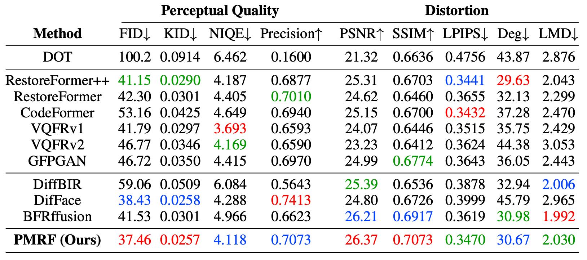

<div align="center">

# Posterior-Mean Rectified Flow:<br />Towards Minimum MSE Photo-Realistic Image Restoration

[[Paper](https://arxiv.org/abs/2410.00418)] [[Project Page](https://pmrf-ml.github.io/)] [[Demo](https://huggingface.co/spaces/ohayonguy/PMRF)]

[Guy Ohayon](https://ohayonguy.github.io/), [Tomer Michaeli](https://tomer.net.technion.ac.il/), [Michael Elad](https://elad.cs.technion.ac.il/)<br />
Technion—Israel Institute of Technology

</div>

> PMRF is a novel photo-realistic image restoration algorithm. It (provably) approximates the **optimal** estimator that minimizes the Mean Squared Error (MSE) under a perfect perceptual quality constraint.

<div align="center">
    
</div>

---

<div align="center">

[](https://github.com/ohayonguy/PMRF/blob/main/LICENSE)
[](https://github.com/pytorch/pytorch)
[](https://github.com/Lightning-AI/pytorch-lightning)
[](https://huggingface.co/spaces/ohayonguy/PMRF)
[](https://hits.sh/github.com/ohayonguy/PMRF/)

</div>

# 📈 Some results from our paper
### CelebA-Test quantitative comparison

Red, blue and green indicate the best, the second best and the third best scores, respectively.



### WIDER-Test visual comparison


### WebPhoto-Test visual comparison


# ⚙️ Installation
We created a conda environment by running the following commands, exactly in the given order (these are given in the `install.sh` file):

```
conda create -n pmrf python=3.10
conda activate pmrf
conda install pytorch==2.3.1 torchvision==0.18.1 torchaudio==2.3.1 pytorch-cuda=11.8 -c pytorch -c nvidia
conda install lightning==2.3.3 -c conda-forge
pip install opencv-python==4.10.0.84 timm==1.0.8 wandb==0.17.5 lovely-tensors==0.1.16 torch-fidelity==0.3.0 einops==0.8.0 dctorch==0.1.2 torch-ema==0.3
pip install natten==0.17.1+torch230cu118 -f https://shi-labs.com/natten/wheels
pip install nvidia-cuda-nvcc-cu11
pip install basicsr==1.4.2
pip install git+https://github.com/toshas/torch-fidelity.git
pip install lpips==0.1.4
pip install piq==0.8.0
pip install huggingface_hub==0.24.5
```

1. Note that the package `natten` is required for the HDiT architecture used by PMRF.
Make sure to replace `natten==0.17.1+torch230cu118` with the correct CUDA version installed on your system.
Check out https://shi-labs.com/natten/ for the available versions.
2. We installed `nvidia-cuda-nvcc-cu11` because otherwise `torch.compile` got hanging for some reason.
`torch.compile` may work in your system without this package. In any case, if you wish to do so, you may simply skip
this package and/or remove all the `torch.compile` lines from our code.
3. Due to a compatibility issue in `basicsr`, you will need to modify one of the files in this package.
Open `/path/to/env/pmrf/lib/python3.10/site-packages/basicsr/data/degradations.py`, where `/path/to/env` is the path
where your conda installed the `pmrf` environment.
Then, change the line
```
from torchvision.transforms.functional_tensor import rgb_to_grayscale
```
to
```
from torchvision.transforms.functional import rgb_to_grayscale
```

 
# ⬇️ Downloads
## 🌐 Model checkpoints
We provide our blind face image restoration model checkpoint in [Hugging Face](https://huggingface.co/ohayonguy/PMRF_blind_face_image_restoration) and in [Google Drive](https://drive.google.com/drive/folders/1dfjZATcQ451uhvFH42tKnfMNHRkL6N_A?usp=sharing).
The checkpoints for section 5.2 in the paper (the controlled experiments) can be downloaded from [Google Drive](https://drive.google.com/drive/folders/1dfjZATcQ451uhvFH42tKnfMNHRkL6N_A?usp=sharing). Please keep the same folder structure as provided in Google Drive:

```
checkpoints/
├── blind_face_restoration_pmrf.ckpt    # Checkpoint of our blind face image restoration model.
├── swinir_restoration512_L1.pth    # Checkpoint of the SwinIR model trained by DifFace
├── controlled_experiments/     # Checkpoints for the controlled experiments
│   ├── colorization_gaussian_noise_025/
│   │   ├── pmrf/
│   │   │   └── epoch=999-step=273000.ckpt
│   │   ├── mmse/
│   │   │   └── epoch=999-step=273000.ckpt
.   .   .
.   .   .
.   .   .
```
To evaluate the landmark distance (LMD in the paper) and the identity metric (Deg in the paper), you will also need to download the `resnet18_110.pth` and `alignment_WFLW_4HG.pth` checkpoints from the [Google Drive](https://drive.google.com/drive/folders/1k3RCSliF6PsujCMIdCD1hNM63EozlDIZ) of [VQFR](https://github.com/TencentARC/VQFR). Place these checkpoints in the `evaluation/metrics_ckpt/` folder.

## 🌐 Test data sets for blind face image restoration
1. Download WebPhoto-Test, LFW-Test, and CelebA-Test (HQ and LQ) from https://xinntao.github.io/projects/gfpgan.
2. Download WIDER-Test from https://shangchenzhou.com/projects/CodeFormer/.
3. Put these data sets wherever you want in your system.


# 🧑 Blind face image restoration (section 5.1 in the paper)
## ⚡ Quick inference
To quickly use our model, we provide a [Hugging Face checkpoint](https://huggingface.co/ohayonguy/PMRF_blind_face_image_restoration) which is automatically downloaded. Simply run
```
python inference.py \
--ckpt_path ohayonguy/PMRF_blind_face_image_restoration \
--ckpt_path_is_huggingface \
--lq_data_path /path/to/lq/images \
--output_dir /path/to/results/dir \
--batch_size 64 \
--num_flow_steps 25
```
Please alter `--num_flow_steps` as you wish (this is the hyper-parameter `K` in our paper)

You may also provide a local model checkpoint (e.g., if you train your own PMRF model, or if you wish to use our [Google Drive](https://drive.google.com/drive/folders/1dfjZATcQ451uhvFH42tKnfMNHRkL6N_A?usp=sharing) checkpoint instead of the Hugging Face one). Simply run
```
python inference.py \
--ckpt_path ./checkpoints/blind_face_restoration_pmrf.ckpt \
--lq_data_path /path/to/lq/images \
--output_dir /path/to/results/dir \
--batch_size 64 \
--num_flow_steps 25
```
Importantly, note that our blind face image restoration model is trained to handle square and aligned face images. To restore general content face images (e.g., where there is more than one face in the image), you may use our [Hugging Face demo](https://huggingface.co/spaces/ohayonguy/PMRF).

## 🔬 Evaluation

1. We downloaded the `resnet18_110.pth` and `alignment_WFLW_4HG.pth` checkpoints from the [Google Drive](https://drive.google.com/drive/folders/1k3RCSliF6PsujCMIdCD1hNM63EozlDIZ) of [VQFR](https://github.com/TencentARC/VQFR), and put these in the folder `evaluation/metrics_ckpt/`.
To evaluate the results on CelebA-Test, run:
```
cd evaluation
python compute_metrics_blind.py \
--parent_ffhq_512_path /path/to/parent/of/ffhq512 \
--rec_path /path/to/celeba-512-test/restored/images \
--gt_path /path/to/celeba-512-test/ground-truth/images
```
To evaluate the results on the real-world data sets, run:
```
cd evaluation
python compute_metrics_blind.py \
--parent_ffhq_512_path /path/to/parent/of/ffhq512 \
--rec_path /path/to/real-world/restored/images \
--mmse_rec_path /path/to/mmse/restored/images
```
The `--mmse_rec_path` argument is optional, and allows you to compute IndRMSE, as an indicator of the true RMSE for real-world degraded images.
Note that the MMSE reconstructions are saved automatically when you run `inference.py`, since the MMSE model
is also in the PMRF checkpoint.

## 💻 Training
In the folder `scripts/` we provide the training scripts we used for blind face image restoration and for training
the baseline models as well. If you want to run a script, you need to execute it in the root folder
(where `train.py` is located). To train the model, you will need the FFHQ data set.
We downloaded the original FFHQ 1024x1024 data set and down-sampled the images to size 512x512 using bi-cubic down-sampling.

1. Copy the `train_pmrf.sh` file (located in `scripts/train/blind_face_restoration`) to the root folder.
2. Adjust the arguments `--train_data_root` and `--val_data_root` according to the location of the training and validation data in your system.
3. The SwinIR model which was trained by [DifFace](https://github.com/zsyOAOA/DifFace) is provided in the `checkpoints/` folder. We downloaded it via
```
wget https://github.com/zsyOAOA/DifFace/releases/download/V1.0/swinir_restoration512_L1.pth
```
4. Adjust the argument `--mmse_model_ckpt_path` to the path of the SwinIR model.
5. Adjust the arguments `--num_gpus` and `--num_workers` according to your system.
6. Run the script `train_pmrf.sh` to train our model.


# 👩‍🔬 Controlled experiments (section 5.2 in the paper)
We provide training and evaluation codes for the controlled experiments in our paper, where we compare PMRF with the following baseline methods:
1. **Flow conditioned on Y**: A rectified flow model which is *conditioned* on the *input measurement*, and learns to flow from pure noise to the ground-truth data distribution.
2. **Flow conditioned on the posterior mean predictor**: A rectified flow model which is *conditioned* on the *posterior mean prediction*, and learns to flow from pure noise to the ground-truth data distribution.
3. **Flow from Y**: A rectified flow model which flows from the degraded measurement to the ground-truth data distribution.
4. **Posterior mean predictor**: A model which is trained to minimize the MSE loss.

## 🔬 Evaluation
We provide checkpoints for quick evaluation of PMRF and all the baseline methods.
1. The evaluation is conducted on CelebA-Test images of size 256x256. To acquire such images, we downloaded the CelebA-Test (HQ) images from [GFPGAN](https://xinntao.github.io/projects/gfpgan), and down-sampled them to 256x256 using bi-cubic down-sampling.
2. Adjust `--test_data_root` in `test.sh` to the path of the CelebA-Test 256x256 images, and adjust `--degradation` and `--ckpt_path` to the type of degradation you wish to assess and the corresponding model checkpoint.
3. Run `test.sh`.

We automatically save the reconstructed outputs, the degraded measurements, as well as the samples from the source distribution (the images from which the ODE solver begins).
After running `test.sh`, you may evaluate the results via :

```
cd evaluation
python compute_metrics_controlled_experiments.py \
--parent_ffhq_256_path /path/to/parent/of/ffhq256 \
--rec_path /path/to/restored/images \
--gt_path /path/to/celeba-256-test/ground-truth/images
```

## 💻 Training

* We trained our models on FFHQ 256x256. To acquire such images, with down-sampled the original FFHQ 1024x1024 images using bi-cubic down-sampling.
* The training scripts of PMRF and each of these baseline models are provided in the `scripts/train/controlled_experiments/` folder.
* To run each of these scripts, you need to copy it to the root folder where `train.py` is located. All you need to do is adjust the `--degradation`, `--source_noise_std`, `--train_data_root` and `--val_data_root` arguments in each script. For denoising, we used `--source_noise_std 0.025`, and for the rest of the tasks we used `--source_noise_std 0.1`.
* To run the `train_pmrf.sh` and `train_posterior_conditioned_on_mmse_model.sh` scripts, you first need to train the MMSE model via `train_mmse.sh`. Then, adjust the `--mmse_model_ckpt_path` argument according to the path of the MMSE model final checkpoint.


## 📝 Citation
    @article{ohayon2024pmrf,
      author    = {Guy Ohayon and Tomer Michaeli and Michael Elad},
      title     = {Posterior-Mean Rectified Flow: Towards Minimum MSE Photo-Realistic Image Restoration},
      journal   = {arXiv preprint arXiv:2410.00418},
      year      = {2024},
      url       = {https://arxiv.org/abs/2410.00418}
    }

## 📋 License and acknowledgements
This project is released under the [MIT license](https://github.com/ohayonguy/PMRF/blob/main/LICENSE).

We borrow codes from [BasicSR](https://github.com/XPixelGroup/BasicSR), [VQFR](https://github.com/TencentARC/VQFR), [DifFace](https://github.com/zsyOAOA/DifFace), [k-diffusion](https://github.com/crowsonkb/k-diffusion), and [SwinIR](https://github.com/JingyunLiang/SwinIR). We thank the authors of these repositories for their useful implementations.

## 📧 Contact
If you have any questions or inquiries, please feel free to [contact me](mailto:guyoep@gmail.com).
